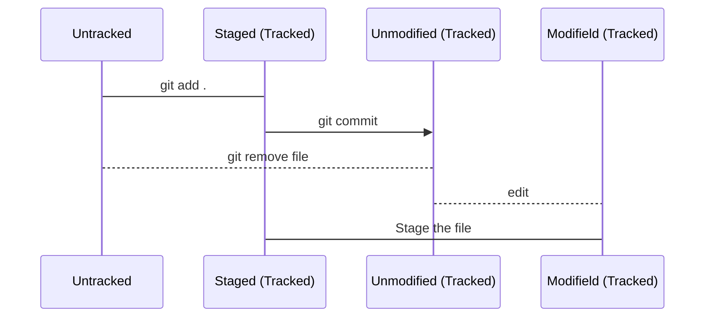

###Estados do Git

**Untracked:** são aqueles que o Git não está rastreando, ou seja, são arquivos novos ou existentes na pasta de trabalho, mas que ainda não foram adicionados ao repositório Git.

&nbsp;

**Modified (modificado):** o arquivo foi alterado na pasta de trabalho, mas ainda não foi adicionado ao index (staging area).

&nbsp;

**Staged (estagiado):** o arquivo foi adicionado ao index e está pronto para ser incluído no próximo commit;

&nbsp;

**Unstaged (não estagiado):**o arquivo foi alterado na pasta de trabalho depois de ter sido adicionado ao index, mas ainda não foi adicionado novamente ao index;

&nbsp;

                    

